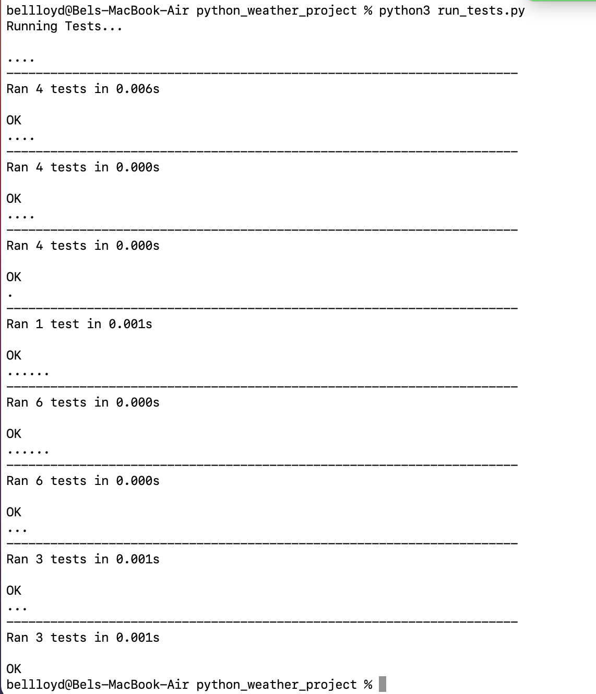

# weather-project
Containing files for the weather project.

## Live Repo Link

[weather-project repo link](https://bel-lloyd.github.io/weather-project/)

## Repo Link on Github
[repo-on-github link](https://github.com/bel-lloyd/weather-project)

## Screenshots

- Tests running successfully screenshot
    - OK from all test!
    